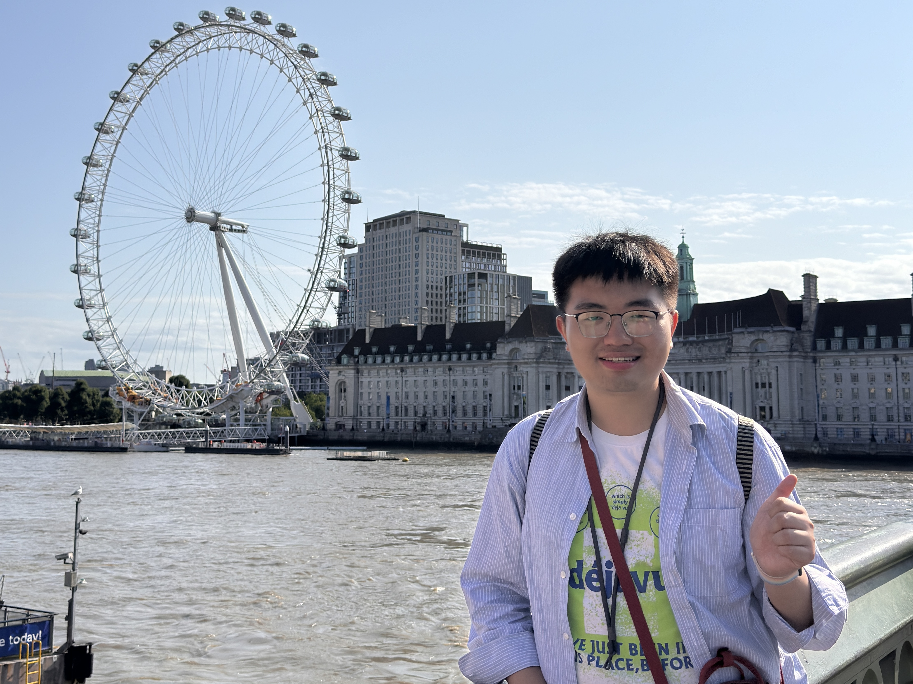

# 欢迎来到我的个人主页！ / 歡迎嚟到我嘅主頁！ / Welcome to my homepage! / Willkommen auf meiner Homepage!

## 关于我 / 關於我 / About me / Über mich

- 姓名 / Name：王培正（Ralph Peizheng Wong）
- 学号 / Student ID：2025303110143
- 专业 / Major：资源环境信息工程（Resource and Environmental Information Engineering）
- 籍贯 / Hometown：重庆北碚（Beibei District, Chongqing City, China）
- 研究兴趣 / Research Interest：生态遥感（Ecological Remote Sensing）
- 语言技能 / Language Skills：普通话 Mandarin Chinese（母语 Native Language）、英语 English（熟练 Fluent）、德语 Deutsch（学习中 Learning）、广东话 Cantonese（学习中 Learning）

## 教育背景 / Education Background

- **2020年9月-2024年6月     华中农业大学     环境生态工程（水土保持方向）     工学学士**
  - **平均绩点为3.46/4.00，专业排名为6/25。** 
  - 主修课程包含水力学（98）、水土保持监测与高分遥感（95）、水土保持林学（93）、农业气象学（93）、土壤学（93）、水土保持方案编制（93）、土壤侵蚀原理（92）、景观生态学（92）、土壤与农化分析（91）、水土保持工程制图（90）、地质与地貌学（90）。
- **2025年9月至今     华中农业大学     资源环境信息工程     农学硕士（免试在读）**

## 学生工作经历 / Student Work Experience

- **2023.09-2024.07     共青团华中农业大学委员会     宣传部办公室助管**
  - 在岗期间协助校团委老师开展了学习贯彻习近平总书记给“本禹志愿服务队”重要回信精神系列活动、华中农业大学2025年狮山欢乐节、“弘扬雷锋精神 争做时代先锋”主题音乐团课等大型活动。
- **2023.11-2024.01     武汉市洪山区华中农业大学附属学校     实习老师**
  - 协助班主任完成教育教学工作，形成了30份听课记录，10份备课教案。
- **2021.2-2022.09     华中农业大学大学生艺术团     小宇宙合唱团团干**
  - 负责日常训练、考勤、后勤、宣传等工作，与校大学生艺术团秘书处对接。

## 基层工作经历 / Grassroots Work Experience

- **2024.08-2025.07     贵州省毕节市大方县猫场镇为民小学     研究生支教团志愿者**
  - 校务工作：承担二年级数学、体育，三年级英语，四年级英语的教学工作，负责校内文化活动、兴趣社团指导等校务工作。
  - 团队工作：主要负责华中农业大学第二十届研究生支教团贵州为民小学分队宣传工作及美育工作，服务期内发布多篇公众号推文，被中国青年网、全国全国高校思想政治工作网转载。指导为民小学小星球合唱团，拍摄5支合唱MV，受到贵州日报等媒体的报道。

## 荣誉称号（部分） / Awaeds(part)

- 2025.05 获2025年贵州青年五四奖章（集体）
- 2024.06 获华中农业大学2024届优秀毕业生称号 
- 2021.05 获全国第六届大学生艺术展演活动艺术表演类甲组一等奖
- 2020.12 获第七届湖北省大学生艺术节活动一等奖
- 2021.08 获资源与环境学院“公共服务先进个人”称号

## 技能与特长 / Skills and Versatility

- 语言技能：通过大学英语六级（CET-6:548），普通话二级甲等。
- 办公技能：熟练操作基本的Office 办公软件，微信公众号排版，新闻稿撰写。
- 其他技能：中小学教师资格证（高中地理），声乐与合唱等。

## 个人兴趣爱好 / Personal Interests

- 音乐：喜爱国际流行、另类音乐、轻摇滚等音乐流派，喜爱Lana Del Rey、Charli XCX、HAIM等音乐人。
- 航空迷：喜爱国泰航空 Cathay Pacific（中国香港 Hong Kong, China）、新加坡航空 Singapore Air（新加坡 Singapore）、中华航空 China Airlines（中国台北 Taipei, China）等航司的公司文化与服务，喜爱Airbus 350-900、Airbus 380-800、Boeing 747-8等客机。
- 摄影：喜爱拍摄胶片、富士拍立得、宝丽来。

## 照片 / Pictures

